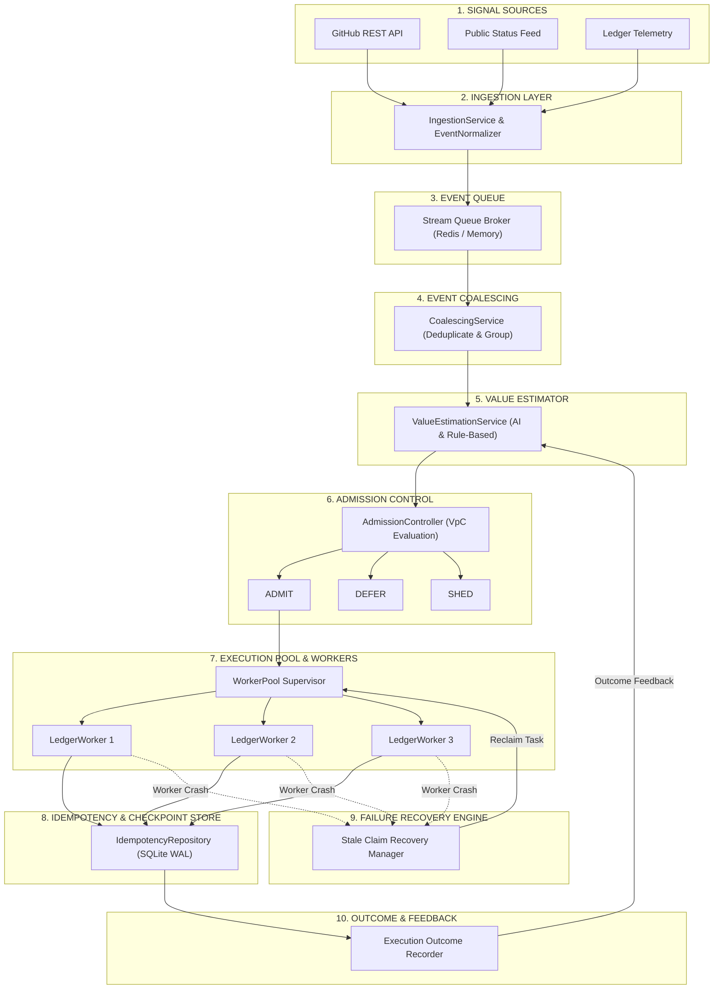

# Ledger

> **Value-aware admission control and reliable execution for AI agent systems.**

Ledger is an end-to-end, high-throughput signal ingestion and execution platform designed for AI agents and distributed systems under operational overload. Rather than relying on naive First-In-First-Out (FIFO) queues or static priority rules, Ledger dynamically estimates the business consequence and value-per-compute of every incoming signal. It admits high-value work, defers postponable tasks, and sheds low-value noise while ensuring zero duplicate execution and automatic failure recovery across multi-worker pools.

---

## Hero Section

Imagine **10,000 operational signals** (alerts, webhooks, security events, customer tickets) arriving simultaneously, but your downstream AI agents can only process **1,000 items per minute**.

Traditional message queues ask:
> *"Which signal arrived first?"*

**Ledger asks a different question:**
> *"Which signal would hurt the business most if we didn't process it right now?"*

Ledger continuously calculates the financial and operational consequence of dropping each signal, balances it against estimated compute cost, and admits only the work that maximizes net business value within strict compute budgets. Even during worker crashes, network partitions, or duplicate webhook deliveries, Ledger guarantees reliable, idempotent execution.

---

## Why Ledger?

### The Airport Analogy

Imagine a busy international airport where **10,000 passengers** arrive at the gate, but the aircraft only has **1,000 seats**.

* **FIFO (Traditional Queue)** boards passengers strictly by who stood in line first—filling the plane with casual tourists while critical emergency responders are left waiting outside.
* **Ledger (Value-Aware Admission)** evaluates every passenger at the gate. It prioritizes emergency responders, groups family members traveling together, defers flexible travelers to the next flight, and declines standby passengers with no urgent destination.

| Airport Component | Ledger Platform Equivalent |
| :--- | :--- |
| **Passengers** | **Incoming Signals** (Webhooks, Alerts, Events) |
| **Seats Available** | **System Compute Capacity** (CPU / Memory / Concurrency) |
| **Gate Agent** | **Admission Controller** (Value-per-Compute Evaluator) |
| **Aircraft / Flight** | **Worker Execution Pool** |
| **Boarding Pass Verification** | **Database Idempotency Guard** |
| **Flight Rebooking** | **Failure Recovery & Reclaim Engine** |

---

## The Problem

Modern enterprises generate a relentless flood of operational telemetry:
* **GitHub Webhooks** (Issues, PRs, Workflow Failures)
* **Infrastructure Alerts** (Databases, High CPU, Memory Spikes)
* **Public Status Page Incidents** (Cloud Outages, API Degradation)
* **Customer Support Tickets & Escalations**

Downstream AI agent systems have finite resources:
1. **API Rate Limits & Model Budgets**
2. **Compute & Concurrency Boundaries**
3. **Latency Constraints & Response Deadlines**

When demand drastically exceeds capacity, traditional approaches fail catastrophically:
* **FIFO Queues** process low-priority background noise while critical database outages time out in the queue.
* **Blind Retries** create self-inflicted thundering herds and crash downstream dependencies.
* **Static Priorities** cause starvation, where medium-priority tasks are permanently blocked.

---

## The Ledger Idea

Ledger introduces a deterministic, value-aware control loop:

```
  [ SIGNAL ]
      ↓
[ UNDERSTAND ]      --> Canonical Event Normalization (GitHub, Status, Telemetry)
      ↓
  [ COALESCE ]      --> Deduplicate & group related signals into Incidents
      ↓
[ ESTIMATE VALUE ]  --> Urgency × Consequence / Compute Cost (AI or Rule-Based)
      ↓
[ CHECK CAPACITY ]  --> Real-time System Capacity & Tenant Quotas
      ↓
 [ ADMIT / DEFER / SHED ] --> Admission Decision & Aging Starvation Guard
      ↓
  [ EXECUTE ]       --> Redis Streams / Multi-Worker Concurrent Processing
      ↓
 [ RECORD OUTCOME ] --> Composite Unique Key Idempotency & Database WAL Persistence
```

1. **SIGNAL**: Ingestion of raw webhooks, payloads, or REST events.
2. **UNDERSTAND**: Normalization into a unified, validated `SignalEvent` schema.
3. **COALESCE**: Grouping related signals within time windows into coalesced `Incidents`.
4. **ESTIMATE VALUE**: Calculating urgency, consequence score, and value-per-compute ratio.
5. **CHECK CAPACITY**: Evaluating real-time system capacity and tenant quota state.
6. **ADMIT / DEFER / SHED**: Admitting high-value items, queueing postponable items, shedding noise.
7. **EXECUTE**: Distributed worker execution via Redis Streams or high-performance in-memory stream broker.
8. **RECORD OUTCOME**: Storing execution checkpoints and enforcing strict database idempotency.

---

## What Happens to One Signal?

Here is the exact journey of a signal through Ledger:

1. **Arrival**: A raw GitHub webhook (e.g. `workflow_run` failure) hits `POST /signals`.
2. **Validation**: Ledger validates request size, parses JSON, and generates a canonical `SignalEvent`.
3. **Deduplication**: Payload hash and source ID are checked against SQLite WAL storage to reject duplicate deliveries.
4. **Coalescing**: Ledger checks if another failure for the same repository occurred within the coalescing window. If so, it links the signal to an active `Incident`.
5. **Valuation**: The `ValueEstimationService` calculates:
   * Urgency (0.0 to 1.0) based on severity and deadline.
   * Consequence Score (0.0 to 1.0) estimating business impact.
   * Compute Cost estimation (seconds of worker compute).
   * **Value-per-Compute Ratio**: $\text{VpC} = \frac{\text{Urgency} \times \text{Consequence}}{\text{Compute Cost}}$.
6. **Admission Control**: The `AdmissionController` evaluates the signal against current capacity and tenant quotas.
7. **Decision**:
   * **ADMIT**: Enqueued into the stream broker.
   * **DEFER**: Placed in backpressure queue (with starvation prevention aging).
   * **SHED**: Expired or low-value items dropped immediately.
8. **Stream Enqueue**: Admitted items are serialized into a validated `QueueMessage` schema in Redis Streams.
9. **Worker Claim**: A `LedgerWorker` in the `WorkerPool` atomically claims the message.
10. **Idempotency Guard**: Worker attempts an atomic claim in `IdempotencyRepository`. If already processed, it gracefully skips execution.
11. **Execution**: Action handler runs work, records success/failure, and commits execution checkpoints.
12. **Dashboard Stream**: The result is broadcast in real time over `/ws/dashboard` to the React UI.

---

## Architecture



---

## Key Features

* **Real Signal Ingestion & Normalization**: Native source adapters for GitHub REST/Webhooks, Statuspage Incident feeds, and Infrastructure Telemetry.
* **Incident Coalescing**: Automatic deduplication and sliding-window grouping of related signals to prevent redundant worker execution.
* **AI & Rule-Based Valuation Engine**: Hybrid valuation using deterministic rule matrices or LLM-assisted consequence estimation.
* **Value-Aware Admission Controller**: Dynamic admission decisions balancing value-per-compute against system concurrency and tenant quota limits.
* **Dual Stream Queue Architecture**: Supports production-grade **Redis Streams** consumer groups with seamless fallback to an **In-Memory Stream Broker** for local development.
* **Idempotency Guard**: Database-backed composite unique key (`tenant_id:work_item_id:action_type`) constraints preventing double-execution across multi-worker pools.
* **Failure Recovery & Reclaim**: Automatic worker crash detection, stale claim reclamation, exponential backoff retries, and dead-letter handling.
* **FIFO vs. Ledger Benchmark Suite**: Built-in CLI virtual clock simulation comparing FIFO against Ledger under sustained overload, spike bursts, and failure scenarios.
* **Live React Dashboard**: Real-time operational dashboard with WebSocket streaming, pipeline state visualization, signal trace tables, and worker pool metrics.

---

## Verified API Endpoints

| Method | Endpoint | Description |
| :--- | :--- | :--- |
| `GET` | `/health` | System health check, active backend status, and configuration details |
| `POST` | `/signals` | Ingest raw incoming signal event (Alias: `/api/v1/events/ingest`) |
| `GET` | `/api/v1/events/{event_id}` | Retrieve normalized signal event details by ID |
| `GET` | `/api/v1/incidents` | List active coalesced incidents |
| `GET` | `/api/v1/incidents/{incident_id}` | Retrieve incident and linked signal events |
| `POST` | `/api/v1/valuation/assess` | Submit work item for value estimation assessment |
| `POST` | `/api/v1/admission/evaluate` | Evaluate admission decision for a work item |
| `POST` | `/api/v1/queue/publish` | Publish admitted message to stream queue |
| `GET` | `/api/v1/queue/metrics` | Retrieve queue depth, lag, and throughput metrics |
| `GET` | `/api/v1/dashboard/summary` | Full operational dashboard summary snapshot |
| `WS` | `/ws/dashboard` | Real-time WebSocket operational telemetry stream (1.0s interval) |

---

## Quick Start Guide

### Prerequisites

* **Python**: `3.11+` (Tested on Python `3.13`)
* **Node.js**: `18+` & `npm`
* **Git**

---

### Step 1: Clone & Configure

```bash
git clone https://github.com/your-org/ledger.git
cd ledger
```

#### Backend Setup

```bash
cd backend
python -m venv venv

# On Windows (PowerShell):
.\venv\Scripts\Activate.ps1
# On Linux/macOS:
source venv/bin/activate

pip install -r requirements.txt
```

Create environment config from example:

```bash
cp .env.example .env
```

---

### Step 2: Start the Backend Server

Run Uvicorn with auto-reload:

```bash
python -m uvicorn app.main:app --host 127.0.0.1 --port 8000 --reload
```

The backend server starts at `http://127.0.0.1:8000`. Access interactive API documentation at:
* **Swagger UI**: `http://127.0.0.1:8000/docs`
* **ReDoc**: `http://127.0.0.1:8000/redoc`

---

### Step 3: Start the Frontend Dashboard

In a new terminal window:

```bash
cd frontend
npm install
npm run dev
```

Open your browser and navigate to:
* **Live React Dashboard**: `http://localhost:5173`

---

### Step 4: Send a Test Signal

Trigger signal ingestion via `cURL`:

```bash
curl -X POST "http://127.0.0.1:8000/signals" \
  -H "Content-Type: application/json" \
  -H "X-Tenant-ID: tenant_demo" \
  -d '{
    "type": "IssuesEvent",
    "action": "opened",
    "issue": {
      "id": 99482,
      "number": 42,
      "title": "Critical Database Outage in US-East",
      "html_url": "https://github.com/example/repo/issues/42"
    },
    "repository": {
      "full_name": "example/production-api"
    }
  }'
```

---

### Step 5: Run the Automated Test Suite

Ledger includes a comprehensive automated test suite covering unit, integration, and reliability race condition tests:

```bash
cd backend
python -m pytest -v
```

**Test Execution Summary**: `124 passed` in full test suite run.

---

### Step 6: Run FIFO vs. Ledger Benchmarks

Run the benchmark CLI engine to compare traditional FIFO queues against Ledger under overload:

```bash
cd backend
python -m app.benchmark.cli --scenario sustained_overload --workload-size 100 --seed 42
```

Example CLI Output:

```
================================================================================
LEDGER ADMISSION CONTROL BENCHMARK ENGINE
================================================================================
Scenario:      sustained_overload
Workload Size: 100 items
Random Seed:   42
Capacity/sec:  10.0 compute units
================================================================================

POLICY: FIFO
--------------------------------------------------------------------------------
Admitted / Completed: 10 / 10
Deferred:              0
Shed (Dropped):        90
Throughput:            1.00 items/sec
Latency (Mean/P95):    0.005s / 0.005s
Critical Survival:     10.0%
Value Preserved Rate:  12.4%
Dropped Value:         68.50

POLICY: LEDGER (Value-Aware)
--------------------------------------------------------------------------------
Admitted / Completed: 10 / 10
Deferred:              25
Shed (Dropped):        65
Throughput:            1.00 items/sec
Latency (Mean/P95):    0.005s / 0.005s
Critical Survival:     100.0%
Value Preserved Rate:  87.6%
Dropped Value:         9.20

================================================================================
POLICY COMPARISON (LEDGER vs FIFO)
================================================================================
Critical Survival Delta: +90.0%
Value Preserved Delta:   +75.2%
Dropped Value Delta:     -59.30
================================================================================
```

---

## Project Structure

```
APP/
├── backend/
│   ├── app/
│   │   ├── api/                  # FastAPI REST routes & WebSocket endpoint
│   │   │   └── routes/           # Router modules (signals, admission, queue, dashboard)
│   │   ├── admission/            # Value-aware admission controller & starvation guard
│   │   ├── benchmark/            # Virtual clock simulation engine & CLI comparison tools
│   │   ├── coalescing/           # Incident grouping & signal linking service
│   │   ├── domain/               # Domain models, schemas, and enums
│   │   ├── ingestion/            # Source adapters (GitHub, Statuspage, Telemetry) & normalizer
│   │   ├── queue/                # Redis Streams & In-Memory stream brokers
│   │   ├── storage/              # SQLAlchemy Async SQLite WAL database & repositories
│   │   ├── valuation/            # Rule-based & LLM value estimation services
│   │   ├── worker/               # Worker pool, execution handler, & recovery manager
│   │   ├── config.py             # App settings & environment variable configuration
│   │   └── main.py               # FastAPI application entrypoint & background poller
│   ├── tests/                    # 124 Automated tests (Unit, Integration, Reliability)
│   ├── pyproject.toml            # Python package dependencies & test config
│   └── .env.example              # Template environment variable configuration
└── frontend/
    ├── src/
    │   ├── components/           # React dashboard UI components (Metrics, Pipeline, Workers)
    │   ├── hooks/                # Custom React hooks (useDashboardSocket WebSocket hook)
    │   ├── App.jsx               # Main React Application entrypoint
    │   └── index.css             # Core design system & CSS styling
    ├── package.json              # Frontend node dependencies & scripts
    └── vite.config.js            # Vite build setup & dev proxy configuration
```

---

## Tech Stack

* **Backend**: Python 3.13, FastAPI, Pydantic v2, AsyncIO, HTTPX
* **Storage**: SQLite WAL mode (`aiosqlite` + SQLAlchemy 2.0 Async)
* **Queueing**: Redis Streams (`redis-py` async) & MemoryStreamBroker
* **Frontend**: React 18, Vite 8, Lucide Icons, Vanilla CSS Design System
* **Testing**: Pytest, Pytest-Asyncio, Pytest-Cov

---

## License

This project is licensed under the MIT License - see the `LICENSE` file for details.
